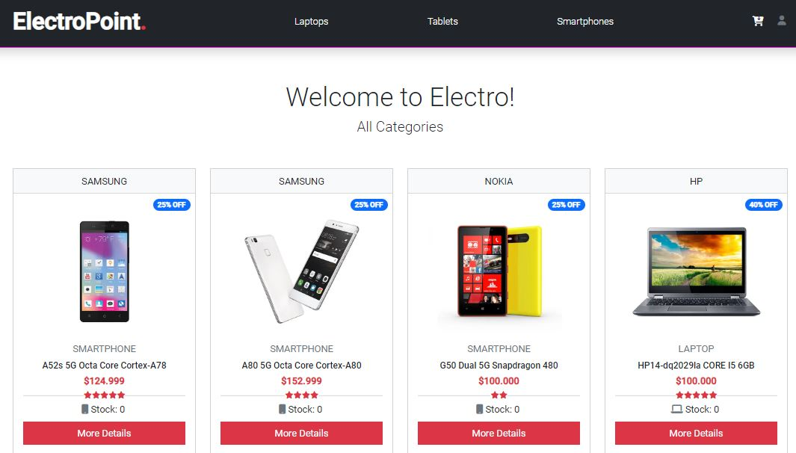
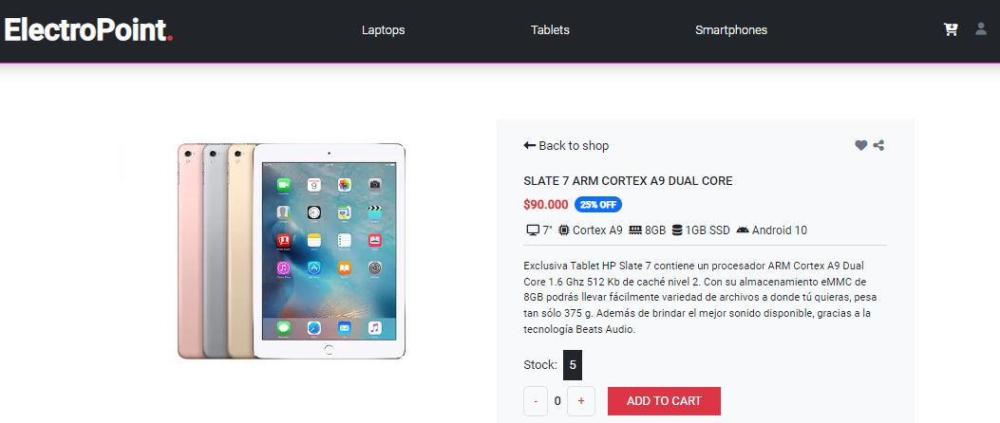
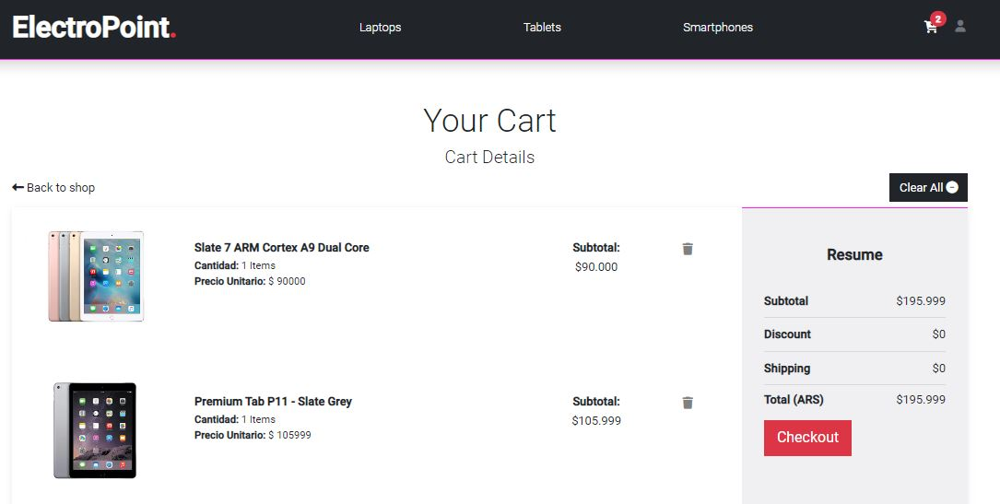

# Proyecto Tienda Online con React #40295
Proyecto Final de Tienda online para el curso de React Js #40295 en Coderhouse.

## Detalles Con Imagenes:
- Se ingresa a la web y el usuario puede navegar por las diferentes categorias, ver los articulos e ingresar a los detalles.


- Al ingresar al detalle se puede visualizar: Descripcion foto, precio y stock disponible. incrementa o decrementa la cantidad deseada y al darle a "add to cart" y luego "Checkout" en el carrito.


- Al sumar cantidades al Carrito  lista los mismo y muestra un resumen de la compra, totalizando la compra. Si no se desea un articulo o vaciar el mismo puede realizarlo. Confirma la accion luego de realizada.

- Al cargar los datos del formulario de compra (Que se validan), se actulizan los datos en la base de datos y arroja un numero de orden


## Instalación 🔧

```
  npm install 
  npm start
```

## Deployment 📦

- https://proyecto-ecommerce-react.netlify.app/

## Desarrollado con 🛠️
- CSS
- HTML
- Bootstrap
- Javascript
- React
- React-router-dom
- Sweetalert 2
- Font awesome
- Firebase
- Google Fonts

## Autor ✒️

- **Jacqueline Menes** 